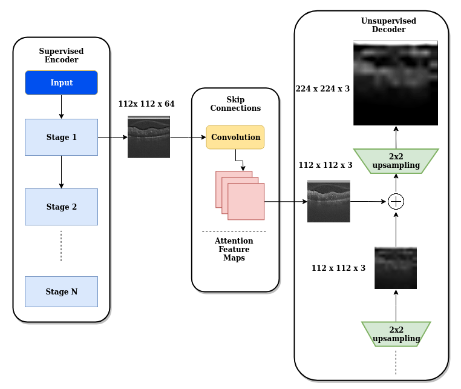

# ICIP2020 Joint Robust Attention Network

[](https://paperswithcode.com/sota/retinal-oct-disease-classification-on?p=improving-robustness-using-joint-attention)
[](https://paperswithcode.com/sota/retinal-oct-disease-classification-on-oct2017?p=improving-robustness-using-joint-attention)

This code is part of the supplementary materials for the IEEE ICIP 2020 for our paper Improving robustness using Joint Attention network for Optical Coherence Tomography Images . The paper has since been accpeted to IEEE ICIP 2020 and will be preseneted in October 2020.



### Arxiv Pre-print
```
https://arxiv.org/abs/2005.08094
```
### IEEE Xplore Digital Library
```
https://ieeexplore.ieee.org/document/9190742
```

# Citation 
```
@INPROCEEDINGS{9190742,

  author={S. A. {Kamran} and A. {Tavakkoli} and S. L. {Zuckerbrod}},

  booktitle={2020 IEEE International Conference on Image Processing (ICIP)}, 

  title={Improving Robustness Using Joint Attention Network for Detecting Retinal Degeneration From Optical Coherence Tomography Images}, 

  year={2020},

  volume={},

  number={},

  pages={2476-2480},}
```

# Virtual Oral Presentation (Youtube)

[](https://www.youtube.com/watch?v=eW4gXKvrM3s)


## Pre-requisite
- Ubuntu 18.04 / Windows 7 or later
- NVIDIA Graphics card

## Installation Instruction for Ubuntu
- Download and Install [Nvidia Drivers](https://www.nvidia.com/Download/driverResults.aspx/142567/en-us)
- Download and Install via Runfile [Nvidia Cuda Toolkit 10.0](https://developer.nvidia.com/cuda-10.0-download-archive?target_os=Linux&target_arch=x86_64&target_distro=Ubuntu&target_version=1804&target_type=runfilelocal)
- Download and Install [Nvidia CuDNN 7.6.5 or later](https://developer.nvidia.com/rdp/cudnn-archive)
- Install Pip3 and Python3 enviornment
```
sudo apt-get install pip3 python3-dev
```
- Install Tensorflow-Gpu version-2.0.0 and Keras version-2.3.1
```
sudo pip3 install tensorflow-gpu==2.0.0
sudo pip3 install keras==2.3.1
```
- Install packages from requirements.txt
```
sudo pip3 -r requirements.txt
```
## Training on Srinivasan2014 Dataset

- Please cite the paper if you use their data
```
@article{sri2014,
  title={Fully automated detection of diabetic macular edema and dry age-related macular degeneration from optical coherence tomography images},
  author={Srinivasan, Pratul P and Kim, Leo A and Mettu, Priyatham S and Cousins, Scott W and Comer, Grant M and Izatt, Joseph A and Farsiu, Sina},
  journal={Biomedical optics express},
  volume={5},
  number={10},
  pages={3568--3577},
  year={2014},
  publisher={Optical Society of America}
}
```
### Dataset download link for Srnivinasan2014
```
http://people.duke.edu/~sf59/Srinivasan_BOE_2014_dataset.htm
```

## Folder Structure Rearrangement

- The folder stucture for this dataset needs to be rearranged. We have provided a .py file to rearrange the structure and also, create the necessary directories and sub-directories. Please run the python file **data_preprocess_sri2014.py**. In cmd/terminal type the below command. **Run it as it is or tinker with it, if you wanna change the directory.**

```
python3 data_preprocess_sri2014.py
```

- The structure will look like this before the rearrangement.
```
|──2014_BOE_Srinivasan
|  ├──Publication_Dataset
|     ├──AMD1
|     ├──AMD2
|     ├──DME1
|     ├──DME2
|     .....
|     .....
|     └──NORMAL15
|         └──TIFFs
|             └──8bitTIFFs
├── src
├── LICENSE
├── README.md
├── data_preprocess_sri2014.py
├── inference.py
├── requirements.txt
├── test.py
└── train.py
```
- And it will look like this afterwards.
```
├── data
|   ├──Srinivasan2014
|       ├──Train
|           ├──AMD
|           ├──DME
|           └──NORMAL
|       ├──Test
|           ├──AMD
|           ├──DME
|           └──NORMAL
├── src
├── LICENSE
├── README.md
├── data_preprocess_sri2014.py
├── inference.py
├── requirements.txt
├── test.py
└── train.py
```


- Type this in terminal to run the train.py file
```
python3 train.py --dataset=Srinivasan2014 --datadir=data/Srinivasan2014 --batch=4 --epoch=30 --logdir=optic-net-sri2014-log --snapshot_name=optic-net-sri2014
```
- There are different flags to choose from. Not all of them are mandatory

```
   '--batch', type=int, default=8
   '--input_dim', type=int, default=224
   '--datadir', type=str, required=True, help='path/to/data_directory'
   '--epoch', type=int, default=30
   '--logdir', type=str
   '--weights', type=str,default=None, help='Resuming training from previous weights'
   '--model',type=str, default='OpticNet71',help='Pretrained weights for transfer learning',choices=['OpticNet71','ResNet50', 'MobileNetV2']
   '--snapshot_name',type=str, default=None, help='Name the saved snapshot'
```
# License
The code is released under the MIT License, you can read the license file included in the repository for details.
